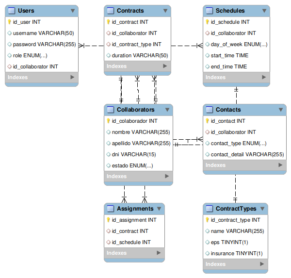

# Sistema de Gestión de Colaboradores

Este proyecto consiste en un sistema de gestión de colaboradores que permite administrar la información relacionada con los colaboradores, sus contratos y sus horarios de trabajo.

## Tablas y Relaciones

### Collaborators (Colaboradores)

- Esta tabla almacena información sobre los colaboradores, como su nombre, apellido, DNI y estado.
- Cada colaborador puede tener varios contratos y horarios asociados.

### Contracts (Contratos)

- Esta tabla almacena información sobre los contratos de los colaboradores, como la duración del contrato y el tipo de contrato.
- Cada contrato está asociado a un colaborador específico mediante la columna `id_collaborator`.
- Puede haber múltiples contratos para un mismo colaborador.

### Schedules (Horarios)

- Esta tabla almacena los horarios de trabajo de los colaboradores.
- Cada horario está asociado a un colaborador específico mediante la columna `id_collaborator`.
- Puede haber múltiples horarios para un mismo colaborador.

## Normalización de la Base de Datos

La base de datos del sistema ha sido diseñada siguiendo los principios de normalización para garantizar la integridad de los datos y reducir la redundancia. Aquí está una breve explicación de cómo se han aplicado los diferentes niveles de normalización:

- **Primera Forma Normal (1FN):** Todos los campos contienen valores atómicos y no se permiten valores múltiples o compuestos en un solo campo. Por ejemplo, en la tabla `Collaborators`, cada atributo como `nombre`, `apellido` y `dni` contiene un único valor atómico.

- **Segunda Forma Normal (2FN):** Todos los campos no clave dependen completamente de la clave primaria. En las tablas `Contracts`, `Schedules` y `Assignments`, los campos no clave dependen completamente de la clave primaria de la tabla correspondiente.

- **Tercera Forma Normal (3FN):** No hay dependencias transitivas entre los campos no clave. La tabla `Contacts` se separa de la tabla `Collaborators` para evitar dependencias transitivas.

- **Forma Normal de Boyce-Codd (BCNF):** Cada dependencia funcional en la base de datos está definida por una clave candidata.

### Colaboradores

- **Crear Colaborador:** Para crear un nuevo colaborador, inserta un nuevo registro en la tabla `Collaborators` con su información correspondiente.
- **Leer Colaborador:** Para obtener la información de un colaborador, realiza una consulta a la tabla `Collaborators` utilizando su `id_colaborador`.
- **Actualizar Colaborador:** Para actualizar la información de un colaborador, modifica los campos correspondientes en la tabla `Collaborators` utilizando su `id_colaborador`.
- **Eliminar Colaborador:** Para eliminar un colaborador, elimina el registro correspondiente de la tabla `Collaborators` utilizando su `id_colaborador`. Esto también eliminará los contratos y horarios asociados a ese colaborador.

### Contratos

- **Crear Contrato:** Para crear un nuevo contrato para un colaborador, inserta un nuevo registro en la tabla `Contracts` con su `id_collaborator` correspondiente y la información del contrato.
- **Leer Contrato:** Para obtener la información de un contrato, realiza una consulta a la tabla `Contracts` utilizando su `id_contract`.
- **Actualizar Contrato:** Para actualizar la información de un contrato, modifica los campos correspondientes en la tabla `Contracts` utilizando su `id_contract`.
- **Eliminar Contrato:** Para eliminar un contrato, elimina el registro correspondiente de la tabla `Contracts` utilizando su `id_contract`.

### Horarios

- **Crear Horario:** Para crear un nuevo horario para un colaborador, inserta un nuevo registro en la tabla `Schedules` con su `id_collaborator` correspondiente y la información del horario.
- **Leer Horario:** Para obtener la información de un horario, realiza una consulta a la tabla `Schedules` utilizando su `id_schedule`.
- **Actualizar Horario:** Para actualizar la información de un horario, modifica los campos correspondientes en la tabla `Schedules` utilizando su `id_schedule`.
- **Eliminar Horario:** Para eliminar un horario, elimina el registro correspondiente de la tabla `Schedules` utilizando su `id_schedule`.
